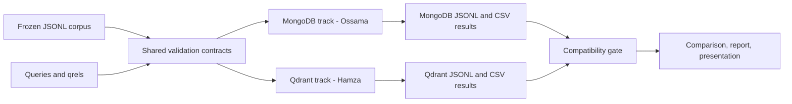

# Architecture and Experiment Boundaries

## Data Flow

## Shared Boundary

`Chunk`, `EvaluationQuery`, `RetrievalResult`, and `RAGResult` are the stable boundary between the experiment harness and a database implementation. `VectorBackend` defines the smallest common ingestion, search, and health-check surface.

Backend-specific capabilities do not leak into this interface. MongoDB hybrid-search settings live in the MongoDB package; Qdrant collection settings live in the Qdrant package. Backend-specific measurements may add separate tables, but the cross-engine table uses only the frozen common fields.

## Reproducibility Gate

The comparison layer must stop when runs disagree on any of these values:

- corpus content hash
- query-set content hash
- embedding model and dimensions
- distance function
- relevance labels
- metric implementation version
- top-k value

This prevents a polished chart from hiding an invalid comparison.

## Failure Boundaries

- Input validation fails with the source filename and line number.
- Ingestion records failed identifiers and never logs secrets.
- Search records timeouts and failed queries instead of silently dropping them.
- RAG distinguishes insufficient evidence from provider failure.
- Result writers use unique run identifiers and preserve previous runs.

## Testing Layers

1. Offline unit tests validate contracts, fixtures, metrics, and context construction.
2. Contract tests exercise the same behavior against both backend adapters.
3. Qdrant integration tests use the supplied Docker service.
4. MongoDB Atlas integration tests are opt-in and require explicit environment variables.
5. A smoke benchmark validates the complete export path before long experiment runs.

